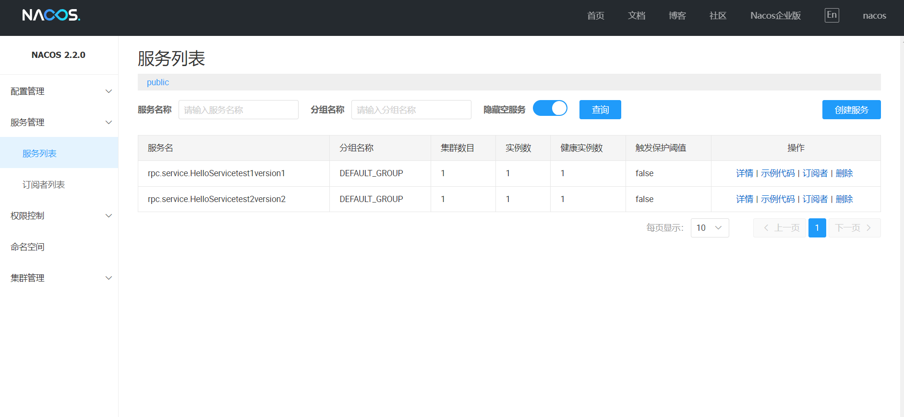
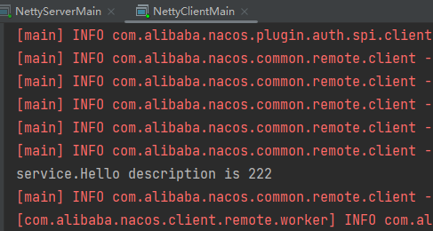

# 简介

该框架实现了RPC的基本功能。服务端将服务注册到注册中心，服务消费者从注册中心获取服务信息后，通过网络请求 服务端并获取所需的响应

# 功能实现

- 使用基于NIO的Netty替代BIO实现网络传输功能 
- 建立客户端与服务端的心跳机制，当出现未知断线情况时，自动重连，确保长连接的可靠性 
- 使用Kryo对消息进行序列化，自定义消息协议和编解码器，避免TCP数据包污染问题 
- 使用Nacos和Zookeeper提供服务的注册与发现 
- 通过自定义注解实现RPC组件扫描、服务注册和服务消费，实现自定义SPI机制

# 运行截图

